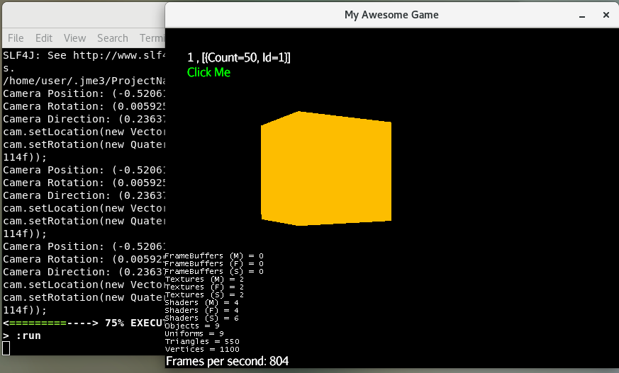

### iBoxDB gradle example with jMonkey Engine

Setup in file **build.gradle**

[build.gradle](build.gradle)





#### Path 1 Run
```
gradle-{version}/bin/gradle run
```


#### Path 2 Run
```sh
/home/user/.gradle/wrapper/dists/gradle-4.10.2-bin/cghg6c4gf4vkiutgsab8yrnwv/gradle-4.10.2/bin/gradle run
```

#### Path 3 Run
```sh
/home/user/.gradle/wrapper/dists/gradle-6.7-bin/efvqh8uyq79v2n7rcncuhu9sv/gradle-6.7/bin/gradle run
```

#### using remote iBoxDB jar

```
 maven {
   url 'https://github.com/iboxdb/teadb/raw/repository'
 } 
```


#### using local iBoxDB jar

mvn deploy:deploy-file -Dfile=iboxdb-3.9.1.jar -DgroupId=iboxdb -DartifactId=iboxdb -Dversion=3.9.1 -Dpackaging=jar -Durl=file:./repository/ -DrepositoryId=repository -DupdateReleaseInfo=true	
    
```
 maven {
   url "file:${project.projectDir}/libs/repository"
 }
```


#### Caches Path
```
/home/user/.gradle/caches/modules-2/files-2.1/iboxdb/iboxdb
```

